# How To Create An Automated Cinema Ticket NFT Creation Dapp with QR Link On The Celo Blockchain

_Estimated reading time: **10 minutes**_

## Table of contents
  * [Introduction](#introduction)
    + [What is the Blockchain all about?](#what-is-the-blockchain-all-about)
    + [What is the Celo Blockchain?](#what-is-the-celo-blockchain)
    + [What is a Smart Contract?](#what-is-a-smart-contract)
  * [Requirements](#requirements)
  * [Prerequisites](#prerequisites)
  * [What you will learn in this tutorial](#what-you-will-learn-in-this-tutorial)
  * [What we will be building](#what-we-will-be-building)
  * [Preparation](#preparation)
  * [Image composing in JS](#image-composing-in-js)
  * [Uploading an image using the Pinata API.](#uploading-an-image-using-the-pinata-api)
  * [Uploading the metadata file to Pinata.](#uploading-the-metadata-file-to-pinata)
  * [Deploying our NFT contract.](#deploying-our-nft-contract)
  * [Conclusion](#conclusion)

## Introduction

### What is the Blockchain all about?
Blockchain is a method of recording information that makes it impossible or difficult for the system to be changed, hacked, or manipulated.
The main advantages of using blockchains are:
- High security.
- Decentralized system.
- Automation capability.

### What is the Celo Blockchain? 
The [Celo](https://celo.org/) blockchain is a carbon-negative, permissionless, layer-1 blockchain with low gas fees. 

The Celo ecosystem consists of a decentralized, proof-of-stake blockchain technology stack (the Celo platform), the Celo governance asset, and several stable assets that make it easy for real-world users to use digital assets.

### What is a Smart Contract? 
A smart contract is a sort of program that encodes business logic and operates on a dedicated virtual machine embedded in a blockchain or other distributed ledger.
Advantages of using smart contracts:
- Autonomy: Smart contracts are performed automatically by the network and reduce the need for a third party to manage transactions between businesses.
- Processing speed: Smart contracts can improve the processing speed of business processes that run across multiple enterprises.
- Cost efficiency: Smart contracts promise to automate business processes that span organizational boundaries.

## Requirements
- A code editor to write JavaScript code.
- [NodeJS](https://nodejs.org/en) installed.
- An internet browser and a good internet connection.
  
## Prerequisites 
- Basic knowledge of Javascript.
- Basic understanding of how the blockchain works.
- Basic knowledge of [Solidity](https://docs.soliditylang.org).
  
## What you will learn in this tutorial
- Creation of a simple NodeJS webpack server.
- Composing images and text in JS.
- Generating QR codes in JS.
- Saving files on the [IPFS](https://ipfs.tech/) storage using the [Pinata](https://www.pinata.cloud/) API.
 
## What we will be building
We will create a system that automatically generates an image that composes a generated QR code with the link we need (in our case, a link to a cinema ticket) and a text label. 

The system automatically will be able to upload created image and metadata file for it to the IPFS manager pinata for further NFT generation.

We will review the NFT contract creation and deploy it on the Celo blockchain.

## Preparation

Let's start by creating a new NodeJS project. To do this, in the previously created folder, create a **package.json** file with the following content:

```json
{
   "license": "MIT",
   "private": true,
   "devDependencies": {
       "html-webpack-plugin": "^4.5.2",
       "webpack": "^4.46.0",
       "webpack-cli": "^3.3.10",
       "webpack-dev-server": "^3.11.3"
   },
   "dependencies": {
       "axios": "^1.3.2",
       "canvas": "^2.11.0",
       "form-data": "^4.0.0",
       "qrcode": "^1.5.1"
   }
}
```

So we installed [webpack](https://webpack.js.org), [axios](https://axios-http.com/docs/intro), [canvas](https://www.npmjs.com/package/canvas), [form-data](https://www.npmjs.com/package/form-data) and [qrcode](https://www.npmjs.com/package/qrcode). You can read about these packages closely on the link above.

Use the following command in the console to install the required libraries.

```bash
npm install
```

Next, we will create the **webpack.config.js** configuration file:

```js
const path = require("path");
const webpack = require("webpack");
const HtmlWebpackPlugin = require("html-webpack-plugin");


module.exports = {
 mode: "development",
 entry: {
   main: path.resolve(process.cwd(), "main.js"),
 },
 plugins: [
   new webpack.ProgressPlugin(),
   new HtmlWebpackPlugin({
     template: path.resolve(process.cwd(), "index.html")
   })
 ]
}
```
Also, we need to set the configuration for our server by creating **index.js** file:

```js
let webpack = require("webpack");
let webpackDevServer = require("webpack-dev-server");
let webpackConfig = require("./webpack.config");

let webpackDevServerOptions = {
 publicPath: "/",
 historyApiFallback: true,
 hot: true,
 host: "0.0.0.0"
};

webpackDevServer.addDevServerEntrypoints(webpackConfig, webpackDevServerOptions);
let app = new webpackDevServer(webpack(webpackConfig), webpackDevServerOptions);
app.listen(process.env.PORT || 3000, () => console.log(`App listening on ${port}`));
```

Now we only need to create the **index.html** file with an empty markup and an empty **main.js** file.

index.html content.
```html
<!DOCTYPE html>
<html lang="en">
<head>
   <meta charset="UTF-8">
   <title>Document</title>
</head>
<body>
</body>
</html>
```

We have created all the necessary files so let's start our server using 
```bash
node index.js
```
If there are no errors in the console, you did everything right.

## Image composing in JS

Our first task will be to create an image that will consist of a QR code and text, we will get the following result:

[<p align="center"></p>][def]

In the process of implementing this project, I tried to find information on the internet on how to compose an image (QR code) and the text I needed correctly, but I did not find a single article on this topic.

So I decided to do it all with the help of canvases.

> Canvas - element is used to draw graphics, on the fly, via JavaScript. An element is only a container for graphics. You must use JavaScript to draw the graphics.

With canvases, we can perform other operations with images, such as composing them. 

In the **main.js** connect the previously installed libraries:

```js
import QRCode from "qrcode";
import axios from "axios";
import FormData from "form-data";
import { createCanvas, loadImage } from "canvas";
```

Let's write a function that will create an image and return it's data URL.

```js
const renderQRcode = async (ticket_id) => {
   // size of canvas image
   const canvas = createCanvas(200, 200);
   const ctx = canvas.getContext('2d');
   // font size and family
   ctx.font = '20px Arial';
   // label text
   const textString = "Ticket #" + ticket_id;
   // measure width of text
   const textWidth = ctx.measureText(textString).width;
   /* set label on image
       first parameter is our text string
       second parameter is x position, in my case, position will be on center of the image
       third parameter is y position
   */
   ctx.fillText(textString, (canvas.width / 2) - (textWidth / 2), 180);
   // setting qr code image options
   const qrOption = {
       width: 180,
       padding: 0,
       margin: 0
   };
   // setting a string qr code will contain
   const qrString = window.location.origin + "/ticket_info/" + ticket_id;
   // getting a data url of generated qr code
   const bufferImage = await QRCode.toDataURL(qrString, qrOption);
   // render our qr code buffer url to image
   return loadImage(bufferImage).then((image) => {
       // draw our qr code image on canvas with text label
       // parameters are: Image, dx, dy, dw, dh
       ctx.drawImage(image, 22, 5, 155, 155);
       // return data url of the generated image
       return canvas.toDataURL();
   });
}
```

Let's test it by putting it on the screen.

After the created function, write the following code:

```js
// we need to use anonymous async function
(async () => {
   // create new image node
   var img = new Image();
   // set image src as data url from our function
   img.src = await renderQRcode(1);
   // show image
   document.body.appendChild(img)
})();
```

The result of the script:

[<p align="center">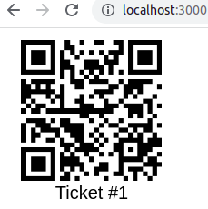</p>][def]

## Uploading an image using the Pinata API.

> API is a way for two or more computer programs to communicate with each other using requests.

> Pinata is a media management company for builders and creators of all kinds in web3.

With Pinata, we can store our files as IPFS.

> IPFS is a distributed file storage protocol that allows computers all over the globe to store and serve files as part of a giant peer-to-peer network.

First, we need to register on [Pinata](https://www.pinata.cloud) and generate a new key to access the API. Our key must have an API Endpoint Access for pinFiletoIPFS and pinJSONToIPFS.

[<p align="center">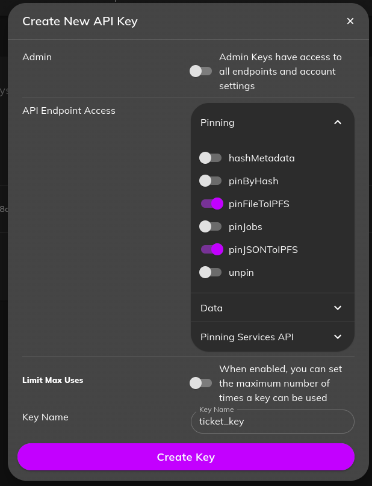</p>][def]

For our next steps we need only the **JWT** key.

> **_NOTE:_** To send a file to Pinata, it must be of the `blob` type, for this we need to modify the previously written renderQRcode function.

```js
// we added a new parameter, type of the result, by default it is blob
const renderQRcode = async (ticket_id, type="blob") => {
   …
   // render our qr code buffer url to image
   return loadImage(bufferImage).then((image) => {
       // draw our qr code image on canvas with text label
       // parameters are: Image, dx, dy, dw, dh
       ctx.drawImage(image, 22, 5, 155, 155);
       // return data url of the generated image
       if(type === "data")
           return canvas.toDataURL();
       // return blob object of the generated image
       return new Promise((resolve) => {
           canvas.toBlob(resolve);
       });
   });
}
```

Now, in the absence of the second parameter, we will receive a blob object of our image. But, we can always execute a function with the second parameter "data" to return a data-url.

As before, let's write a new function in our main.js file. We will use the code from the Pinata official [documentation](https://docs.pinata.cloud/pinata-api/pinning/pin-file-or-directory).

```js
// upload image to pinata
const uploadTicketImage = async (ticket_id) => {
   // render image as blob object
   const image = await renderQRcode(ticket_id);
   // our api jwt key from pinata
   const jwt_key = "";
   try {
       const data = new FormData();
       // third parameter will be image name
       data.append('file', image, `ticket_${ticket_id}.jpg`);
       const res = await axios.post("https://api.pinata.cloud/pinning/pinFileToIPFS", data, {
           maxBodyLength: "Infinity",
           headers: {
               'Content-Type': `multipart/form-data; boundary=${data._boundary}`,
               Authorization: `Bearer ${jwt_key}`
           }
       });
       // return ipfs hash of uploaded image
       return res.data.IpfsHash;
   } catch (error) {
       console.log(error);
   }
}
```

> **_NOTE:_** I recommend storing the keys in a separate secure file. I saved it in a variable just for example, never do that in real projects.

Let's output the result of the function to the console using the following code:

```js
// we need to use anonymous async function
(async () => {
   console.log(await uploadTicketImage(1));
})();
```

After opening our page in the browser, the image will be automatically sent to the pinata service. In the console we will see the ipfs hash of our image.

[<p align="center">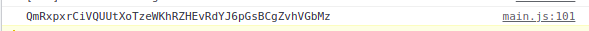</p>][def]

Let's open the pinata control panel and test our image.

[<p align="center">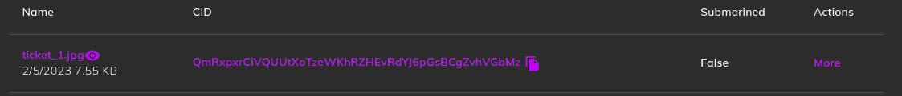</p>][def]

You can also look at our image at this link. We will need this link later.
> https://gateway.pinata.cloud/ipfs/[YOUR IPFS HASH]

## Uploading the metadata file to Pinata.

To generate an NFT, we need to store a metadata file that contains a path to our image.

Let's write a new function in the **main.js** file:

```js
// upload metadata json file to pinata
// we will set already stored image hash as a parameter hash
const uploadJson = async (ticket_id, hash) => {
   // our api jwt key from pinata
   const jwt_key = "";
   // options, we set name of the file to ticket[number]_metadata.json and image to pinata gateway url
   var data = JSON.stringify({
       "pinataOptions": {
           "cidVersion": 1
       },
       "pinataMetadata": {
           "name": `ticket${ticket_id}_metadata.json`
       },
       "pinataContent": {
           "image": `https://gateway.pinata.cloud/ipfs/${hash}`
       }
   });
   var config = {
       method: 'post',
       url: 'https://api.pinata.cloud/pinning/pinJSONToIPFS',
       headers: {
           'Content-Type': 'application/json',
           'Authorization': `Bearer ${jwt_key}`
       },
       data: data
   };
   const res = await axios(config);
   // return uploaded file ipfs hash
   return res.data.IpfsHash;
}
```

Again, we will rewrite the anonymous function for output to the console.

```js
// we need to use anonymous async function
(async () => {
   // id of a ticket
   const ticket_id = 1;
   // upload image and save ipfs hash
   const image_hash = await uploadTicketImage(ticket_id);
   // log to console ipfs hash of metadata.json file
   console.log(await uploadJson(ticket_id, image_hash))
})();
```

The result of the script:

[<p align="center">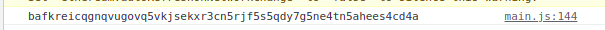</p>][def]

Let's check the contents of the uploaded metadata file. [Here](https://gateway.pinata.cloud/ipfs/bafkreicqgnqvugovq5vkjsekxr3cn5rjf5s5qdy7g5ne4tn5ahees4cd4a) we can make sure that the image link is identical to the one we got earlier.

At this point, we have successfully generated our image and saved it and the metadata of the image to Pinata.

The next step will be generating an NFT using the IPFS hash obtained above.

## Deploying our NFT contract.

To begin with, we need to write our smart contract in the Solidity programming language. We will use the IDE [Remix](http://remix.ethereum.org/).

We also need a Metamask wallet with the Celo Alfajores testnet added and [test tokens](https://faucet.celo.org)

Let's create a file ticket.sol in the remix with the following content:

```solidity
//SPDX-License-Identifier: GPL-3.0
pragma solidity ^0.8.10;

import "@openzeppelin/contracts/token/ERC721/ERC721.sol";
import "@openzeppelin/contracts/token/ERC721/extensions/ERC721URIStorage.sol";
import "@openzeppelin/contracts/access/Ownable.sol";
import "@openzeppelin/contracts/utils/Counters.sol";

/** @title NFT contract to mint NFT tickets */
contract TicketNFT is ERC721, ERC721URIStorage, Ownable {
   // unique counter, uses to set every nft’s id
   using Counters for Counters.Counter;
   Counters.Counter private _tokenIds;
   // first parameter of ERC721 constructor is Token name, the second is token symbols 
   constructor() ERC721("TICKETTOKEN", "TCKT") { }
   /**
    * @param to address of an nft receiver
    * @param uri link to nft metadata file
    */
   function safeMint(address to, string memory uri) public {
       // increment counter for every token
       _tokenIds.increment();
       // store new id in a variable
       uint256 newItemId = _tokenIds.current();
       // mint new token to the receiver
       _mint(to, newItemId);
      
       // set custom uri
       _setTokenURI(newItemId, uri);
   }
   // The following functions are overrides required by Solidity.
   function _burn(uint256 tokenId)
       internal
       override(ERC721, ERC721URIStorage)
   {
       super._burn(tokenId);
   }
   function tokenURI(uint256 tokenId)
       public
       view
       override(ERC721, ERC721URIStorage)
       returns (string memory)
   {
       return super.tokenURI(tokenId);
   }
}
```

Next, select the compiler version(In our case it is 0.8.10) and compile our contract.

[<p align="center">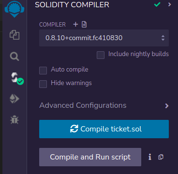</p>][def]

Next, we need to deploy our contract. To do this, go to the appropriate tab, connect a Metamask wallet, and click the **Deploy** button.

[<p align="center">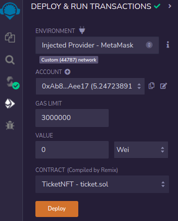</p>][def]

We need to pay gas fees to deploy a contract. Next, we can refer to the methods of our contract.

[<p align="center">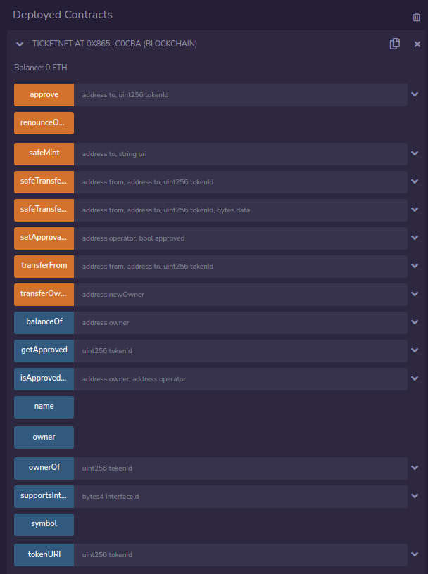</p>][def]

Let's take the IPFS hash of the previously created ticket1_metadata.json file

> bafkreicqgnqvugovq5vkjsekxr3cn5rjf5s5qdy7g5ne4tn5ahees4cd4a.

The link to the pinata gateway will be

> https://gateway.pinata.cloud/ipfs/bafkreicqgnqvugovq5vkjsekxr3cn5rjf5s5qdy7g5ne4tn5ahees4cd4a

Let's execute the **safeMint** method of the contract. We pass the address of our wallet in the **to** parameter, then the **uri** will be the link to the ipfs metadata file. Next, click on the **Transact** button.

[<p align="center">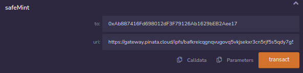</p>][def]

We will see the result of execution.

[<p align="center">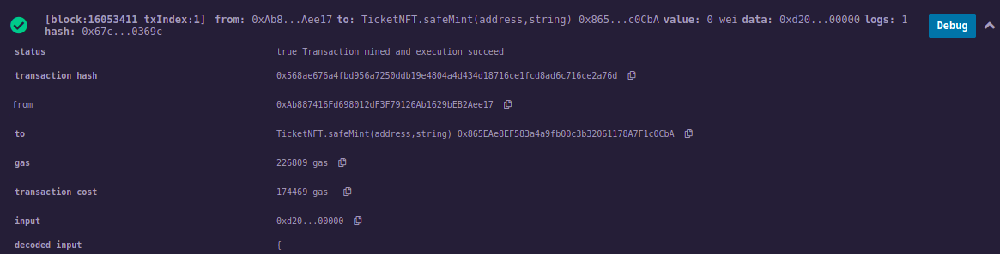</p>][def]

We are interested in the **transaction_hash** value. Copy it and find this transaction on the [Celo explorer website](https://explorer.celo.org/alfajores).

We can see our transaction. Let's click on the ID of our NFT to view it.

[<p align="center">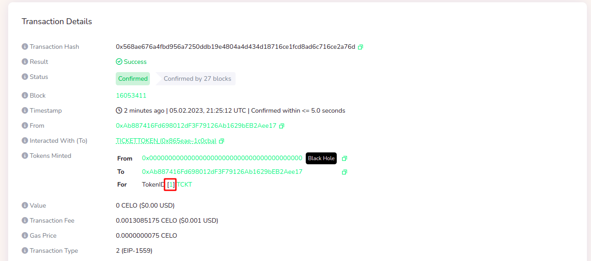</p>][def]

A view of our NFT.

[<p align="center">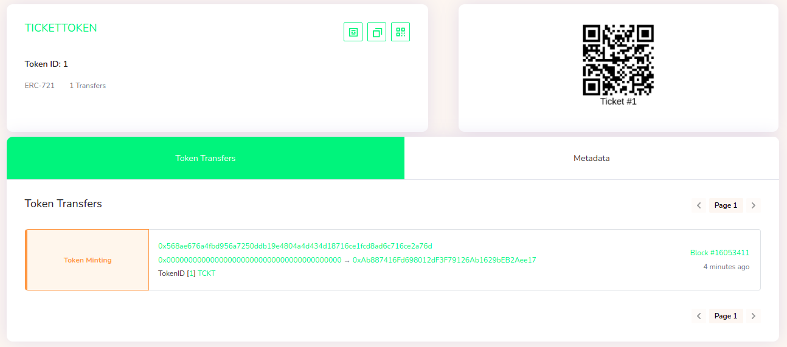</p>][def]

## Conclusion

My greetings, we have successfully generated an image containing a QR code and text, uploaded it and its metadata file to the IPFS server through Pinata, and minted an NFT from this image.

P.S. You can find all the files used in this tutorial using [this link](https://github.com/nadiarei/celo-js-tutorial/sources).
A real project where I used this script - [celo-react-cinema-dapp](https://github.com/nadiarei/celo-react-cinema-dapp)

[def]: img
